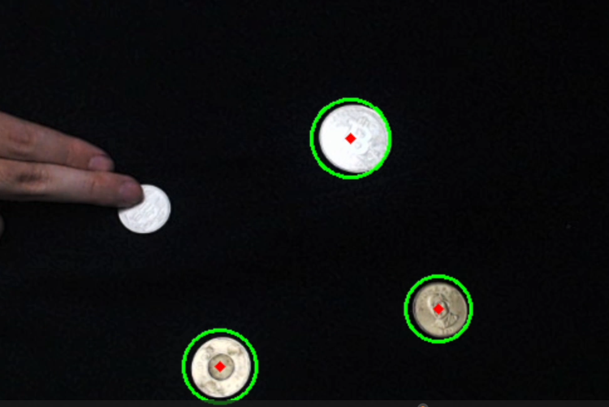
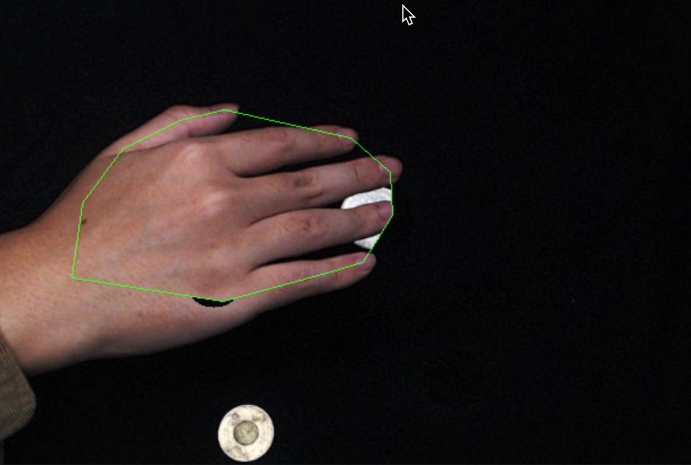
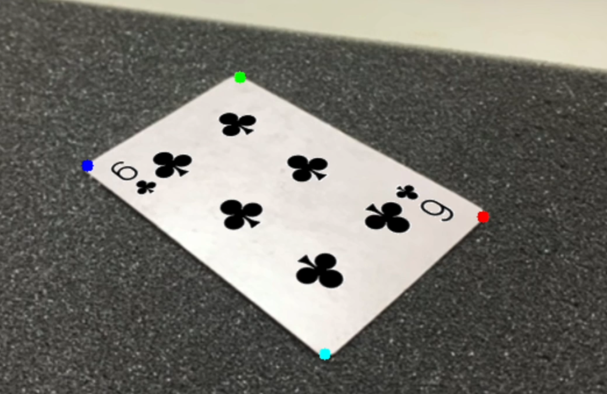
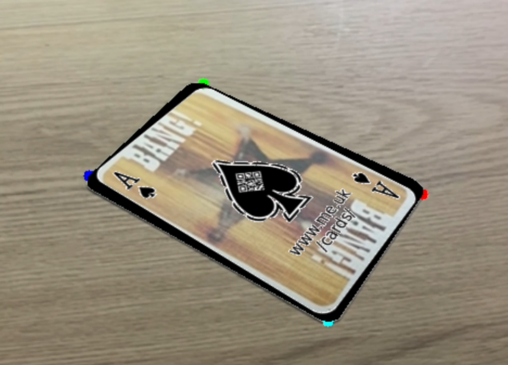
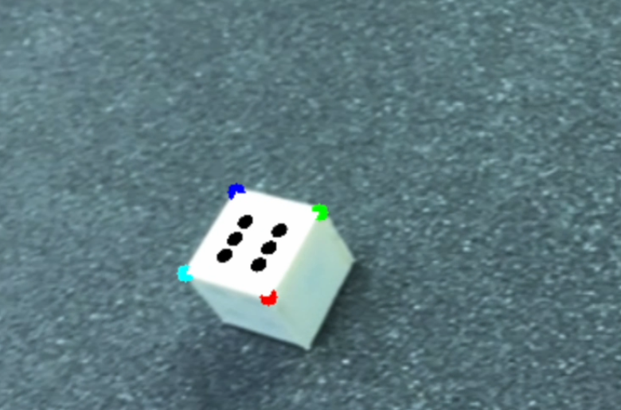

# Magic Tricks on Computer Vision

> Some magic tricks on computer vision, that implemented by python and opencv.
> Also using some other libraries, such as numpy, mediapipe, etc.

## Table of Contents

| No. | Content |
| --- | ------- |
| 1.  | [Overview](#overview) |
| 2.  | [Task1: Coin Magic](#task1-coin-magic) |
| 3.  | [Task2: Card Magic](#task2-card-magic) |
| 4.  | [Task3: Dice Magic](#task3-dice-magic) |
| 5.  | [Difficulty](#difficulty) |
| 6.  | [Installation](#installation) |
| 7.  | [Usage](#usage) |

## Overview

```text
There are 3 magic tricks in this project, which are:
 1. Coin Magic (in task1 folder)
 2. Card Magic (in task2 folder)
 3. Dice Magic (in task3 folder)
```

These tricks could be done by using the webcam of your computer, or you can use the video file in the folder to do the tricks.

All this video works are handled by opencv, and written in `main.py` file.

We also provided `args` to control the program, you can use `python main.py -h` to see the usage, or just view the code below:

```python
parser.add_argument(
        "--file_path",  # Using File Mode --> Path to Video File
        type=str,
        default="",
        help="Using File Mode --> Path to Video File",
        required=False,
    )
    parser.add_argument(
        "--cam_num",    # Using Camera Mode --> Camera Number (Default: 0)
        type=int,
        default=0,
        help="Using Camera Mode --> Camera Number",
        required=False,
    )
    parser.add_argument(
        "--trick",    # Select the Trick Name that want to be Implemented
        type=str,     # (Default: "") If not selected, will show all the tricks on terminal to choose
        default="",
        help="Select the Trick Name that want to be Implemented",
        required=False,
    )
```

While program is running, you can press `q` at any time to quit the program.

By the way, if you are confused about what to do next, view your terminal, it will show you the next step.

## Task1: Coin Magic

### Methods

- Coin Detection: `cv2.HoughCircles()` (Hough Circle Transform)

- Hand Detection: `mediapipe.solutions.hands.Hands()` (MediaPipe Hands)

### Process

>　The process of this trick will be 3 steps:

1. **Capture the Background**

    First, we need to capture the background of the video, and use it to hide the coins later.

    ```text
    Suggestions:
     1. Keep the camera stable & the angle of the camera should not be too tilted.
     2. Keep the background clean & simple.
    ```

    *Press `space` to capture the background and continue*

2. **Detect the Position of the Coins**

    Second, we need to detect the position of the coins by using `cv2.HoughCircles()`.

    

    The program will show you if the coins are detected or not. The coins which is detected will be circled by a green circle.

    *Press `space` to detect the coins and continue*

3. **Magic Start**

    Finally, we can start the magic now!

    The program will hide the coins by using the background we captured before.

    When the hand is passing by the coins, the coins will be shown.

    

    As the figure, you can see that the coin is hidden while the hand is covering it.

    However, the hidden background should not cover the hand, so the hand will be shown.

    ```text
    NOTE:
     Here we draw the contour of the hand in green, so you can see the hand clearly.
     You can close it by turn `draw` to `False` in `main.py`.
    ```

### Features

- Each coin has own state, so you can do the magic with multiple coins.

- By understanding the method, you can do this in opposite way, which is remove coins from the background, and show them after the hand is covering them.

## Task2: Card Magic

### Methods

- Card Detection: `cv2.findContours()` (Contours Detection)

- Corner Detection: `cv2.approxPolyDP()` (Contours Approximation)

- Perspective Transform: `cv2.getPerspectiveTransform()` (Perspective Transform)

- Remove Hole: `cv2.convexHull()` (Convex Hull)

### Process

>　Only 1 step to do this trick:

1. **Magic Start**

    First, we find a clean background, and put the card on it. Make sure that the card has surrounded by white edge, and also let the card be the lightest thing in the background.

    The program would find the lightest thing in the background, and collect the contour of its similar color.

    Then you would see the `club` `6` is printed on the white card.

    

    *Switch the card content by pressing `w` `s` keys*

    Also you can show it on complex content, such as the figure below:

    

    Annouced again, The trick would work if the card is surrounded by white edge, and the card is the lightest thing in the background.

    ```text

    ```text
    NOTE:
     The four corners of the card would be circled in color.
     You can close it by turn `draw` to `False` in `main.py`.
    ```

## Task3: Dice Magic

### Methods

- Dice Detection: `cv2.findContours()` (Contours Detection)

- Dice Corner Detection: `cv2.approxPolyDP()` (Contours Approximation)

- Perspective Transform: `cv2.getPerspectiveTransform()` (Perspective Transform)

The method of Dice is very close to the Card Magic, so I will only explain roughly.

### Process

>　Only 1 step to do this trick:

1. **Magic Start**

    First, we find a clean background, and put the dice on it. Make sure that the dice has surrounded by black background, and also let the dice be the lightest thing in the background.

    The program would find the lightest thing in the background, and collect the contour of its similar color.

    Then you would see the `6` is printed on the white dice.

    

    *Switch the dice content by pressing `w` `s` keys*

    Annouced again, The trick would work if the dice is surrounded by white edge, and the dice is the lightest thing in the background.

    ```text
    NOTE:
     The four corners of the dice would be circled in color.
     You can close it by turn `draw` to `False` in `main.py`.
    ```

## Difficulty

> Here are some difficulties that I met while doing this project: (Some has been solved, some not)

1. **Capture Hand Contour**

    Because `mediapipe` only provide the hand landmark, we need to capture the hand contour by using `cv2.findContours()`. However, its requires lots energy to do this, and could let the video lag.

    On other hand, the coins could be easily influenced the hand shape because their HUE is similar to the skin (I mean gold coins), and also the brightness of the coins may be similar to the skin.

    At last, I decided to find the max polygon that contains the hand landmark, and use it as the hand contour.By doing this, the coin hidden shade would never cover on the hand anymore.(It may be embarrassing if the hand is covered by the hidden shade)

2. **Capture the Coins**

    That I think the trick1 should be implemented in a simple black background, which is restrictful than other tricks. However, when I choose the background, I found that the auto-exposure may kinds of interfere the trick. The Exposure change tragedly when the coins are moving, hands appear. So I set a manual exposure on the camera, and it solved the problem.

3. **Direction of the Card**

    To detect which direction of card is a little bit difficult things to do. I tried to order the corner by clockwise, but there are some cases that the card width would be longer than the height in some tricky angle. In this case, the order of the corner would be wrong. So I use the `x` value of the corner to order them, and it works more stable than before ( But I think it is not the best way).

4. **The Other Face of Dice**

    When the dice is thrown, there will be 3 faces of the dice shown on the screen. However, the different faces of dice could be hard to distinguish in similar light. I thought that I would implement a for loop to find the top 3 lightest faces of cube (Doing this by using `cv2.findContours()`), but it would be too slow to do this. So I still thinking about how to do this better...

## Installation

- Pre-requirements:

  - **Python 3.6+**

  - **OpenCV 4.5.1+**  *( could later install by requirements.txt )*

  - **Numpy 1.19.5+**  *( could later install by requirements.txt )*

  - **Mediapipe 0.8.3+**  *( could later install by requirements.txt )*

- Clone this repository:

    ```bash
    git clone https://github.com/Flyingdolar/Computer-Vision.git
    ```

- Install the requirements:

    ```bash
    pip install -r requirements.txt
    ```

## Usage

- Run the program:

    ```bash
    python main.py
    ```

- Some `args` you could append before run the program

  - `--file_path` ： Using File Mode --> Path to Video File

  - `--cam_num` ： Using Camera Mode --> Camera Number (Default: 0)

  - `--trick` ： Select the Trick Name that want to be Implemented (Default: "") If not selected, will show all the tricks on terminal to choose

    | Trick Name | Command |
    | ---------- | ----------- |
    | Coin Magic | `apply_coin_trick` |
    | Card Magic | `apply_card_trick` |
    | Dice Magic | `apply_dice_trick` |

- Example:

    ```bash
    python3 main.py --trick "apply_coin_trick"
    python3 main.py --trick "apply_card_trick"
    python3 main.py --trick "apply_dice_trick"
    ```

- Key Control:

  - `space` ： Trigger the next step

  - `w` ： Switch the card content / Switch the dice content

  - `s` ： Switch the card content / Switch the dice content

  - `q` ： Quit the program
